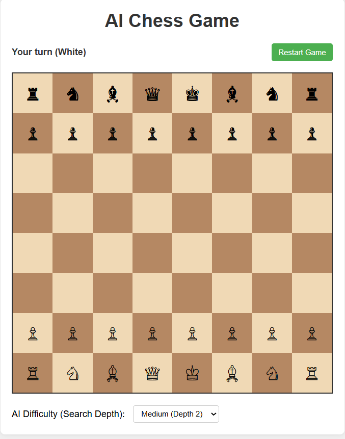

# AI Chess Game

A classic chess game where you play against an AI opponent that uses the Minimax algorithm with Alpha-Beta pruning for intelligent decision making.

## How to Run the Game

1. **Download the files**: Ensure you have all the game files in the correct folder structure:
   - `index.html` (main file)
   - `styles.css` (styling)
   - `script.js` (game logic and AI implementation)

2. **Open the HTML file**: Double-click on `index.html` to open it in your web browser

3. **Start playing**: The game will load automatically and you can start playing immediately as White

## Prerequisites

No installation required! This game runs entirely in your web browser using:

- HTML5 for the structure
- CSS3 for styling and layout
- Vanilla JavaScript for game logic and AI

**Browser Requirements**:
- Any modern web browser (Chrome, Firefox, Safari, Edge)
- JavaScript enabled (enabled by default in most browsers)

## How to Play

1. **Make Your Move**: Click on a white piece to select it, then click on a highlighted square to move it there
2. **AI Response**: The computer will automatically calculate and make its move after you
3. **Win Condition**: Checkmate your opponent's king to win the game
4. **Restart**: Click the "Restart Game" button at any time to start a new game

**Controls**:
- First Click: Select one of your pieces (white)
- Second Click: Move the selected piece to a valid position
- Restart Button: Start a new game at any time
- Difficulty Selector: Choose the AI difficulty level (search depth)

## Algorithms Used

This game implements several important algorithms and programming concepts:

### Minimax Algorithm with Alpha-Beta Pruning:
- **Purpose**: Enables the AI to find the best move by evaluating possible future positions
- **How it works**: Recursively evaluates future game states, maximizing AI advantage and minimizing player advantage
- **Alpha-Beta Pruning**: Optimization technique that significantly reduces the number of positions evaluated
- **Time Complexity**: Exponential based on search depth, but substantially reduced by alpha-beta pruning

### Game Tree Search:
- **Position Evaluation**: Each board position is assigned a score based on material and other factors
- **Look-ahead**: Examines multiple moves ahead to find the best path
- **Pruning**: Skips evaluating branches that won't affect the final decision

### Chess Rules Implementation:
- **Complete Ruleset**: All standard chess piece movements
- **Legal Move Generation**: Ensures only valid moves are offered
- **Check and Checkmate Detection**: Identifies these special game states
- **Pawn Promotion**: Automatically promotes pawns to queens when reaching the opposite end

### Game State Management:
- **Board Representation**: 2D array tracking piece positions
- **Turn Management**: Alternates between human and AI players
- **Visual Feedback**: Highlights selected pieces and valid moves

## Key Features

- **Complete Chess Game**: All standard chess rules implemented
- **Intelligent AI**: Computer opponent that thinks several moves ahead
- **Adjustable Difficulty**: Three difficulty levels from easy to challenging
- **Visual Feedback**: Highlighted valid moves and selected pieces
- **Clean Interface**: Simple, intuitive design with clear visual feedback
- **Responsive Layout**: Adapts to different screen sizes

## Implementation Details

The game is built with three main components:

1. **HTML Structure**: Provides the basic layout of the game
2. **CSS Styling**: Creates an attractive, responsive chess board
3. **JavaScript Logic**:
   - Game state management using 2D array
   - Chess piece movement and rule enforcement
   - AI move calculation using minimax with alpha-beta pruning
   - Check and checkmate detection

## Minimax Algorithm Explained

The AI uses the minimax algorithm with alpha-beta pruning to determine the best move:

1. The AI examines all possible moves it can make
2. For each move, it simulates all possible player responses
3. This continues recursively until reaching the specified search depth
4. Positions are evaluated based primarily on material advantage
5. The AI chooses the move that leads to the highest evaluation score, assuming the player makes optimal moves

The alpha-beta pruning optimization allows the AI to skip evaluating moves that won't affect the final decision, allowing for deeper search without performance issues.

For a detailed implementation guide and code explanations, see [Detailed_Guide.md](Detailed_Guide.md)

## AI Evaluation Function

The AI evaluates board positions primarily by counting the material value of pieces:
- Pawns: 10 points
- Knights and Bishops: 30 points
- Rooks: 50 points
- Queens: 90 points
- Kings: 900 points (though kings can never be captured)

The evaluation adds the value of all AI pieces and subtracts the value of all human pieces, resulting in a score where positive values indicate an AI advantage.

## Taking It Further

To better understand the code or enhance the game, try:

- Implementing special moves (castling and en passant)
- Adding position-based evaluation (piece-square tables)
- Creating a move history display with chess notation
- Adding animations for piece movements
- Implementing more sophisticated board evaluation
- Adding timed play with a chess clock
- Creating a visual indicator for check
- Implementing drag-and-drop for pieces

---

Enjoy your game of chess against the AI!

